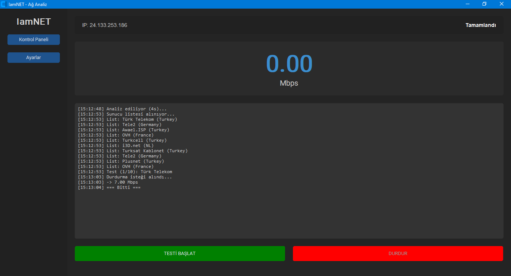
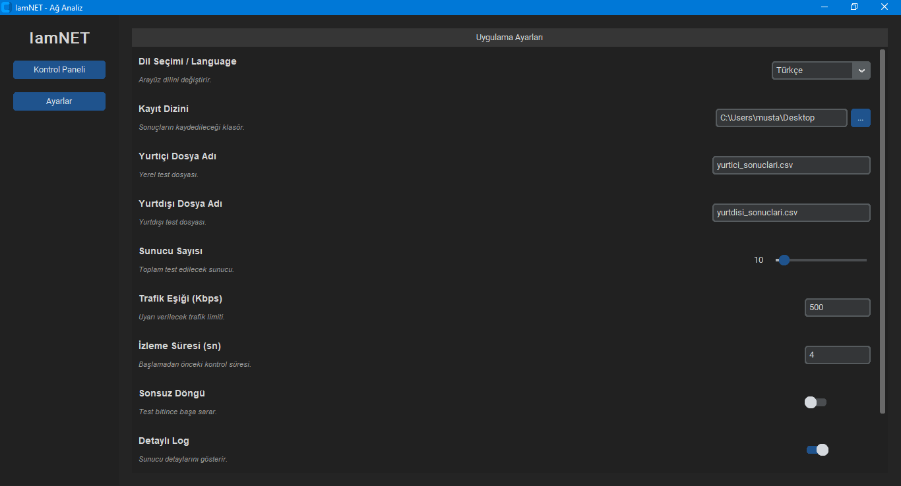

  <a href="README.tr.md">Türkçe</a> |
  <a href="README.en.md">English</a>
  <a href="README.de.md">Deutsch</a>
  <a href="README.fr.md">Français</a>
  <a href="README.es.md">Español</a>
  <a href="README.ru.md">Русский</a>

  
  
  
  
  
  

🔷 IamNET

IamNET ist eine datenschutzorientierte Desktop-Anwendung, die darauf abzielt,
die Internetgeschwindigkeit über mehrere nationale und internationale Server zu messen.
Die Anwendung arbeitet vollständig lokal.

🚀 Funktionen

Geschwindigkeitstest mit mehreren Servern

Trennung zwischen nationalen und internationalen Servern

GUI (basierend auf CustomTkinter)

Erkennung hoher Netzwerkverkehrslast

CSV-Ausgabeunterstützung

Mehrsprachige Infrastruktur (TR / EN verfügbar)

Keine Telemetrie

Keine Datenübertragung

🔐 Datenschutzrichtlinie (Wichtig)

IamNET:

Erfasst keine Benutzerdaten

Überträgt keine Daten

Berichtet nicht an externe Systeme

Speichert keine server- oder benutzerspezifischen personenbezogenen Daten

Lokal gespeicherte Dateien:
Datei	Beschreibung
yurtici_sonuclari.csv	Testergebnisse nationaler Server
yurtdisi_sonuclari.csv	Testergebnisse internationaler Server
config.json	Anwendungseinstellungen

Alle Dateien werden ausschließlich im lokalen Verzeichnis des Benutzers gespeichert.

🖥️ Systemanforderungen

Python 3.14.2

Windows 10 / 11

Linux: Nicht getestet, funktioniert jedoch sehr wahrscheinlich

Für Linux:

sudo apt install python3-tk

⚙️ Installation
git clone https://github.com/FarisHotmail/IamNET.git
cd IamNET
pip install -r requirements.txt
python IamNET.py

🧭 Funktionsweise

Überprüfung der Internetverbindung

Analyse der Netzwerkverkehrslast

Erstellung der Serverliste

Sequenzielles Testen der Server

Speicherung der Ergebnisse in CSV-Dateien

Anzeige der aktuellen Geschwindigkeit über die GUI

📸 Screenshots

🛠️ Geplante Funktionen

CLI-Version (Kommandozeile)

Windows-.exe-Distribution

Unterstützung weiterer Sprachen

Grafikbasierte Geschwindigkeitsverläufe

❓ Häufig gestellte Fragen

Verwendet IamNET speedtest.net?
→ Nein. Serverinformationen stammen aus der Speedtest-Infrastruktur, die Tests selbst erfolgen jedoch über manuelle Downloads.

Warum unterscheiden sich die Ergebnisse?
→ Serverstandort, momentane Netzwerklast und Routing-Unterschiede.

Funktioniert IamNET mit VPN?
→ Ja, allerdings spiegeln die Ergebnisse die VPN-Geschwindigkeit wider.

🤝 Mitwirken

Pull Requests und Issues sind willkommen.
Bei größeren Änderungen wird empfohlen, vorab ein Issue zu eröffnen.

📜 Lizenz

MIT License